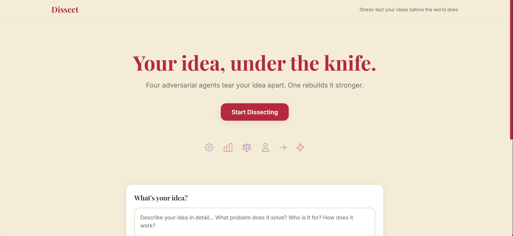

<div align="center">

<svg width="80" height="80" viewBox="0 0 80 80" fill="none" xmlns="http://www.w3.org/2000/svg">
  <path d="M40 8L44 12L52 20L56 32L54 44L48 56L40 68L36 72L32 68L26 56L20 44L18 32L22 20L30 12L34 8L40 8Z" fill="#B5293A"/>
  <path d="M40 8L44 12L48 20L50 28L48 36L44 44L40 52L38 56L36 52L32 44L28 36L26 28L28 20L32 12L36 8L40 8Z" fill="#8B1A28"/>
  <path d="M40 4L42 8L40 72L38 76L36 72L38 8L40 4Z" fill="#B5293A"/>
  <ellipse cx="40" cy="76" rx="4" ry="2" fill="#6B6B6B"/>
  <path d="M38 8L40 4L42 8L44 16L42 24L40 32L38 24L36 16L38 8Z" fill="#FFFFFF" fill-opacity="0.3"/>
</svg>

# Dissect

**Your idea, under the knife.**

Four adversarial AI agents tear your idea apart. One rebuilds it stronger.

<br/>


<br/>



</div>

---

## Architecture

<div align="center">

  


</div>

---

## Features

| Feature | Description |
|---------|-------------|
| **Parallel Agent Critique** | Four specialized AI agents analyze your idea simultaneously, each from a different critical angle |
| **Real-time Streaming** | Watch critiques appear token-by-token via Server-Sent Events |
| **Document Upload** | Submit ideas via text input or upload PDF/DOCX documents |
| **Synthesis Engine** | A fifth agent combines all critiques into a hardened, improved version |
| **Adversarial Prompts** | Agents are genuinely harsh, not politely critical — designed to find real weaknesses |

---

## Tech Stack

| Layer | Technology |
|-------|------------|
| **Backend Framework** | FastAPI with async SSE streaming |
| **Agent Orchestration** | LangGraph with parallel node execution |
| **LLM Provider** | Groq (llama-3.1-70b-versatile) |
| **Document Parsing** | pdfplumber, python-docx |
| **Frontend** | React 18 + Vite |
| **Styling** | Tailwind CSS with custom design system |
| **Streaming** | Native fetch with ReadableStream |

---

## Getting Started

### Prerequisites

- Python 3.10+
- Node.js 18+
- Groq API key ([get one here](https://console.groq.com))

### Backend Setup

```bash
cd dissect-backend

# Create virtual environment
python -m venv venv

# Activate (Windows)
.\venv\Scripts\activate

# Activate (macOS/Linux)
source venv/bin/activate

# Install dependencies
pip install -r requirements.txt

# Configure environment
cp .env.example .env
# Edit .env and add your GROQ_API_KEY

# Run server
uvicorn main:app --reload
```

### Frontend Setup

```bash
cd dissect-frontend

# Install dependencies
npm install

# Run development server
npm run dev
```

Open **http://localhost:5173** in your browser.

---

## How It Works

### 1. Input Processing
The user submits an idea via text or document upload. Documents (PDF/DOCX) are parsed server-side and merged with any typed text.

### 2. Parallel Critique Phase
Four adversarial agents run simultaneously via LangGraph parallel nodes:

- **Technical Skeptic** — Attacks feasibility, scalability, hidden engineering costs, security vulnerabilities
- **Market Critic** — Attacks market size, competition, timing, customer acquisition, unit economics
- **Ethics Advocate** — Exposes bias, misuse potential, privacy risks, regulatory collisions
- **Lazy User Tester** — Attacks onboarding friction, cognitive load, time-to-value

### 3. Synthesis Phase
Once all four agents complete, a fifth Synthesis Agent receives all critiques and generates:

- A rebuilt core idea addressing each weakness
- Specific technical, market, ethics, and UX fixes
- Key trade-offs and 90-day focus recommendations

### 4. Live Streaming
All agent outputs stream token-by-token to the frontend via SSE, rendered with proper markdown formatting.

---

## Project Structure

```
dissect-backend/
    main.py              # FastAPI app, SSE streaming endpoints
    agents.py            # Agent prompts and LangChain chains
    graph.py             # LangGraph parallel execution pipeline
    utils.py             # PDF/DOCX text extraction
    requirements.txt     # Python dependencies
    .env.example         # Environment template

dissect-frontend/
    src/
        App.jsx                  # Main app with SSE handling
        components/
            HeroSection.jsx      # Landing hero with CTA
            InputPanel.jsx       # Text + file upload form
            AgentCard.jsx        # Streaming agent output card
            SynthesisPanel.jsx   # Final synthesis with copy
        index.css                # Tailwind + animations
        main.jsx                 # React entry point
    index.html                   # HTML with Google Fonts
    tailwind.config.js           # Design system config
    package.json                 # Node dependencies
```

---

## API Reference

### POST /analyze

Analyze an idea using adversarial agents.

**Request:** `multipart/form-data`
- `idea` (string, optional): The idea text
- `file` (file, optional): PDF or DOCX document

**Response:** `text/event-stream`

```
data: {"agent": "technical_skeptic", "chunk": "...", "is_done": false}
data: {"agent": "market_critic", "chunk": "...", "is_done": false}
data: {"agent": "synthesis", "chunk": "...", "is_done": true}
data: {"agent": "done", "chunk": "", "is_done": true}
```

### GET /health

Health check endpoint.

**Response:** `application/json`
```json
{"status": "healthy", "service": "dissect-api"}
```

---

<div align="center">

**Dissect** — Stress-test your ideas before the world does.

</div>
